# Recovery Component Implementation Specification

Final, as-implemented specification for ADR-003, ADR-007, and ADR-010's combined
recovery hardware. **Implemented in `marine-tracker-RevA.kicad_sch` (Batch 2,
this session) — ERC = 0 errors, 0 warnings after both checkpoints.** PCB has not
been touched; PCB modification, PCB sync, routing, and Gerber export remain
forbidden per the current phase.

## Circuit overview

Three new ICs, in three independent, domain-appropriate roles:

- **U9 (TPS3839K33DBZR):** brownout supervisor, powered from `VSYS`, detects VSYS
  undervoltage independent of A7670's own `VDD_1V8` rail.
- **U10 (TPS3808G09DBVR):** RESET pulse stretcher, powered from `VSYS`, converts
  TPL5010's (U8's) 320ms `~RST` into a fully-calculated ≥2.5s `MODEM_RESET_N`
  assertion.
- **U11 (TPL5111):** auto-PWRKEY pulse generator (**replaces SN74LVC1G123** — see
  "Blocker 1" below), one-shot triggered via its DELAY/M_DRV pin, qualified by
  U9's SUPV_TRIG and gated against `MODEM_RESET_N` by U12/U13 interlock logic
  so it cannot fire while U10 is asserting RESET.

**As implemented (real reference designators):**

```
                         VSYS
                          │
          ┌───────────────┼───────────────────────┐
          ▼                                        ▼
   U9 TPS3839K33DBZR                          U10 TPS3808G09DBVR
   VDD(3) ── VSYS                             VDD(6) ── VSYS
   GND(1) ── GND                              GND(2) ── GND
   RESET(2) ── net SUPV_TRIG                  SENSE(5) ── VSYS (tied directly — see ADR-007)
   C30 (0.1µF) VSYS–GND, at U9                CT(4) ── C31/C_STRETCH (1µF C0G) ── GND
          │                                   MR(3) ── net WDT_RST_TRIG ◄── U8 (TPL5010) pin6 ~RST
          │                                   R34 (100kΩ) WDT_RST_TRIG–VSYS (external
          │                                   pull-up — see "R34" note below)
          │                                   RESET(1, open-drain) ── net MODEM_RESET_N
          │                                          │
          │                                          ├── R30/R_STRETCH_PU (100kΩ 1%) ── VSYS
          │                                          ├── TP10 (existing)
          │                                          └── U1 (A7670) pin16 RESET (existing)
          │                                          │
          ▼                                          ▼
   U12 (SN74LVC2G08DCUR, dual AND, 3 KiCad units — same physical IC):
     gate 1: 1A(1)=SUPV_TRIG, 1B(2)=MODEM_RESET_N, 1Y(7)=PWRKEY_ARM
     gate 2: 2A(5)=PWRKEY_ARM, 2B(6)=PWRKEY_ARM_DLY_N, 2Y(3)=PWRKEY_TRIG
     GND(4)=GND, VCC(8)=VSYS. C32 (0.1µF) VSYS–GND, at U12.
   U13 (SN74LVC1G14DBVR, Schmitt inverter):
     A(2)=PWRKEY_ARM_DLY, Y(4)=PWRKEY_ARM_DLY_N, GND(3)=GND, VCC(5)=VSYS.
     C33 (0.1µF) VSYS–GND, at U13.
   R32/R_EDGE (150kΩ 1%): PWRKEY_ARM – PWRKEY_ARM_DLY
   C34/C_EDGE (1µF X7R): PWRKEY_ARM_DLY – GND
          │
          ▼ (PWRKEY_TRIG, from U12 gate 2)
   U11 TPL5111DDCR
   VDD(1) ── VSYS
   GND(2) ── GND
   EN/ONE_SHOT(6) ── GND (tied low, permanently selects one-shot mode)
   DONE(4) ── GND (tied low, permanently — no DONE source in this design; guarantees
                the full t_IP−50ms pulse fires every trigger, see timing doc)
   DELAY/M_DRV(3) ── R31/R_EXT (6.19kΩ 1%) ── GND, in parallel with net PWRKEY_TRIG
   DRVn(5, output) ── net AUTO_PWRKEY_DRV ── R33/R_BASE_Q2 (10kΩ) ── Q2 base
          │
          ▼
   Q2 (MMBT2222A)
   collector ── net PWRKEY ── TP9 (existing) ── U1 (A7670) pin1 PWRKEY (existing)
   emitter ── GND
```

**R34 note (discovered during implementation, not in the original plan text):**
Removing R22 took away the only passive pull-up on the net TPL5010's open-collector
`~RST` sits on. TPS3808's MR pin has a genuine internal 70–90kΩ pull-up per its
datasheet (ADR-007), but the generic KiCad symbol doesn't model that, so ERC
correctly flags an undriven-input condition without an explicit external pull-up
present. **R34 (100kΩ, WDT_RST_TRIG–VSYS)** resolves this — good practice
alongside a documented internal pull-up, not merely an ERC workaround, and
electrically consistent with ADR-007's own reference rail (U10's VDD = VSYS).

## Exact BOM

| Ref | Exact MPN | Value | Tolerance | Voltage rating | Footprint | Connected nets | Design equation | Worst-case timing | Datasheet |
|---|---|---|---|---|---|---|---|---|---|
| U9 | **TPS3839K33DBZR** | VIT− = 2.93V (K33) | ±1% (device-trimmed, per datasheet table) | VDD 0.9–6.5V | SOT-23-3 (DBZ) | VDD→VSYS, GND→GND, RESET→SUPV_TRIG | — | Trip point 2.857–2.974V (worst-case-high 2.974V, 126mV margin below the calculated 3.1V nuisance-trip floor) | `tps3839.pdf` Device Options + Electrical Characteristics tables |
| C_U9 | Generic 0.1µF ceramic | 0.1µF | ±10% (X7R) | ≥10V | 0402/0603 | VSYS–GND, at U9 | Standard decoupling per datasheet fig. reference | — | `tps3839.pdf` |
| U10 | **TPS3808G09DBVR** | VIT− = 0.84V (G09, unused — SENSE tied to VDD) | ±2% typ | VDD 1.7–6.5V | SOT-23-6 (DBV) | VDD→VSYS, GND→GND, SENSE→VSYS (direct), CT→C_STRETCH, MR→WDT_RST_TRIG, RESET→MODEM_RESET_N | `t_D(s) = C_T(nF)/175 + 0.5×10⁻³` | Worst-case-low **3.00–3.17s**, worst-case-high **~8.9s** (see full derivation, ADR-007) | `tps3808.pdf` §8.3.2 Eq.1, Electrical/Timing tables |
| C_STRETCH | Generic ceramic, **C0G/NP0 dielectric required** | 1µF | ±10% max (±5% preferred) | ≥10V | 0805/1206 (C0G at 1µF needs a larger case than 0402) | U10 CT pin – GND | Delay equation above | Drives the 3.0–8.9s window above | `tps3808.pdf`: "low-leakage type capacitor such as a ceramic should be used" |
| R_STRETCH_PU | Generic resistor | 100kΩ | ±1% | ≥10V, ≥1/16W | 0402/0603 | MODEM_RESET_N – VSYS | Within datasheet's specified 10kΩ–1MΩ open-drain pull-up range | — | `tps3808.pdf` pin description (RESET pin note) |
| U11 | **TPL5111DDCR** | t_IP=1.5s via R31=6.19kΩ | R31: ±1% (E96) | VDD 1.8–5.5V | SOT-23-6 (DDC) | VDD→VSYS, GND→GND, EN/ONE_SHOT→GND, DONE→GND, DELAY/M_DRV→R31‖PWRKEY_TRIG, DRVn→AUTO_PWRKEY_DRV | `R_EXT = 100×[−b+√(b²−4a(c−100T))]/(2a)`, TI §7.5.3 Eq.1; `t_DRVn = t_IP − 50ms` | **Fully derived: worst-case-low 1.30s (26× the 50ms floor), worst-case-high 1.60s (36% margin below the 2.5s Toff threshold)** | `tpl5111.pdf` §6.5–6.6, §7.5.3 |
| U12 | **SN74LVC2G08DCUR** (dual 2-input AND, VSSOP-8) | — | — | VCC 1.65–5.5V | VSSOP-8 (DCU) | Gate1: SUPV_TRIG,MODEM_RESET_N→PWRKEY_ARM; Gate2: PWRKEY_ARM,PWRKEY_ARM_DLY_N→PWRKEY_TRIG; VCC→VSYS, GND→GND | `PWRKEY_ARM = SUPV_TRIG AND MODEM_RESET_N`; `PWRKEY_TRIG = PWRKEY_ARM AND PWRKEY_ARM_DLY_N` — this is what makes `MODEM_RESET_N=LOW ⟹ PWRKEY_TRIG=LOW` combinational, not timing-dependent | ✅ **Closed this session** — see "Blocker 1: RESOLVED" below | `sn74lvc2g08.pdf` (SCES198N) |
| U13 | **SN74LVC1G14DBVR** (Schmitt inverter, SOT-23-5) | — | — | VCC 1.65–5.5V | SOT-23-5 (DBV) | A→PWRKEY_ARM_DLY (via R32/C34), Y→PWRKEY_ARM_DLY_N, VCC→VSYS, GND→GND | Delay-leg buffer; guaranteed VT+ (1.5–1.87V@3.3V, 2.16–2.74V@4.5V) used for the RC estimate below | 🟡 **Needs Bench Verification** (Level B) — see timing estimate below | `sn74lvc1g14.pdf` (SCES218AA) §5.5 |
| R32 | Generic resistor | 150kΩ | ±1% | ≥10V | 0402/0603 | PWRKEY_ARM – PWRKEY_ARM_DLY (RC delay leg) | See timing estimate below | Nominal 104ms, worst-case-low ≈72ms (3.6× TPL5111's 20ms M_DRV floor), worst-case-high ≈171ms | — |
| C34 | Generic ceramic, X7R | 1µF | ±20% | ≥10V | 0603/0805 | PWRKEY_ARM_DLY – GND | Same as R32 | Same as R32 | — |
| C32, C33 | Generic 0.1µF ceramic | 0.1µF | ±10% | ≥10V | 0402/0603 | VSYS–GND, at U12 and U13 respectively | Standard decoupling | — | — |
| R33 | Generic resistor | 10kΩ | ±5% | ≥10V | 0402/0603 | AUTO_PWRKEY_DRV (U11 DRVn) – Q2 base | I_base ≈ (VSYS−0.7V)/10kΩ ≈ 310µA worst-case-low VSYS → far exceeds the ~28µA minimum needed for Q2 saturation | — | — |
| Q2 | **MMBT2222A** (any listed manufacturer — Nexperia/JSMSEMI/ST/DOWO/MCC all confirmed in stock) | Generic small-signal NPN | — | VCEO ≥40V (device rating, far exceeds VSYS) | SOT-23 | Base→R33, Collector→PWRKEY, Emitter→GND | See "Q2 sizing" below | VCE(sat)≈0.3V typ (generic class figure) | Generic small-signal NPN class datasheet (not individually re-verified per-vendor this session — low-risk, non-timing-critical part) |
| R34 | Generic resistor | 100kΩ | 5% | ≥10V | 0402/0603 | WDT_RST_TRIG – VSYS | Discovered during implementation — see "R34 note" above | Passive pull-up for U8's open-collector `~RST`, alongside U10 MR's internal 70–90kΩ pull-up | — |
| ~~R22~~ | ~~100kΩ~~ | — | — | — | — | ~~was MODEM_RESET_N–VDD_1V8~~ | — | **REMOVED** — superseded by R30/R_STRETCH_PU | ADR-007 |

**Note on reference designators:** the functional labels used in earlier drafts of
this document (`R_STRETCH_PU`, `R_EXT`, `C_STRETCH`, `R_BASE_Q2`, `C_U9`) now have
real KiCad references: R_STRETCH_PU=R30, R_EXT=R31, R_BASE_Q2=R33, C_STRETCH=C31,
C_U9=C30.

### Q2 sizing detail

Worst-case sink current needed: if `PWRKEY` has an internal pull-up on the order of
50kΩ to VBAT≈3.8V (per SIMCom's general pattern for this pin class, not independently
re-confirmed this session — flagged as Needs Verification), pulling the node to
`VIL` (0.3×VBAT ≈ 1.14V) requires `I_sink ≥ (3.8−1.14)/50kΩ ≈ 53µA`. Available
`I_C ≈ I_base × hFE(min)`; even a conservative `hFE(min)=100` on a 310µA base drive
gives `I_C ≈ 31mA` — **~580× the required margin.** ICBO (off-state leakage) for
this transistor class is nA-order at room temperature, negligible against any
realistic PWRKEY pull-up.

## Blocker 1 — SN74LVC1G123 REXT/CEXT timing: RESOLVED by component replacement (TPL5111)

**Re-opened this session and closed definitively.** Direct inspection of the
primary TI datasheet (`sn74lvc1g123.pdf`, SCES586E, revised March 2024,
downloaded and read from rendered page images) shows the earlier "Needs Bench
Verification" status undersold the actual problem: TI's own **guaranteed**
MIN/MAX switching-characteristics tables (§5.8/5.9) cover exactly two REXT/CEXT
points — Rext=10kΩ/Cext=0.01µF (100–110µs) and Rext=10kΩ/Cext=0.1µF
(1.0–1.1ms) — and neither reaches even 1/45th of the 50ms floor. Everything
above 1.1ms, including the entire 50ms–1s range this design needs, exists only
in §5.11/§8.2.3's "Typical Characteristics" log-log curves — **25°C only, no
stated tolerance, no min/max curve**. A "graph-read starting point" from those
curves is not a lower bound; it is a single unverified data point with no proven
floor. **No REXT/CEXT pair can be proven, from TI's primary source, to guarantee
a pulse exceeding 50ms.** This is definitively Option-A-impossible for this
part, not a gap in research effort.

**Replacement selected: TPL5111 (TI), full derivation in
`docs/RECOVERY_TIMING_REQUIREMENTS.md`.** Summary:

- **Explicit equation**, not a graph: `R_EXT = 100×[−b+√(b²−4a(c−100T))]/(2a)`
  (TI `tpl5111.pdf` §7.5.3 Equation 1), with `t_DRVn = t_IP − 50ms` for the
  one-shot pulse actually delivered to Q2's base.
- **Guaranteed minimum, fully computed**: at the selected operating point
  (t_IP=1.5s, R_EXT=6.19kΩ 1%), stacking REXT tolerance, setting accuracy,
  temperature drift (−40 to 105°C), supply-voltage sensitivity, and lifetime
  drift (all from TI's Electrical Characteristics table, §6.5) gives a
  worst-case-low pulse of **1.30s — 26× the 50ms requirement** — and a
  worst-case-high of **1.60s, still 36% below** the A7670's 2.5s power-OFF
  threshold, so the auto-PWRKEY pulse can never be mistaken for a power-off
  command even at the tolerance extreme.
- **IDD 50nA max (guaranteed)** — same nanopower class as the TPL5010/TPS3839
  already in this design (combined budget 185nA); adding TPL5111 brings the
  total to ≈235nA, still negligible against the 20µA VBAT-off floor ADR-002
  already accepted. A classic 555-class timer (TLC555/MIC1555, both checked and
  rejected) draws 170µA–300µA in comparison — a ~1000× regression against this
  design's established low-power philosophy, disqualifying on IQ alone even
  though both have genuine timing equations.
- **Sourcing**: TPL5111DDCR, LCSC C2870554, confirmed in stock this session.

**What TPL5111 does *not* natively provide:** SN74LVC1G123's CLR pin gave a
single-part interlock against `MODEM_RESET_N` "for free." TPL5111 has no
CLR-equivalent — its DELAY/M_DRV pin is a **trigger** input only (guaranteed
≥20ms valid-pulse spec, §6.6), with no inhibit function. This is closed by
U12+U13 (SN74LVC2G08 dual AND + SN74LVC1G14 Schmitt inverter), implemented
this session:

```
PWRKEY_ARM       = SUPV_TRIG AND MODEM_RESET_N                (U12 gate 1)
PWRKEY_ARM_DLY   = RC-delayed copy of PWRKEY_ARM (R32/C34 into U13's Schmitt input)
PWRKEY_ARM_DLY_N = NOT(PWRKEY_ARM_DLY)                         (U13)
PWRKEY_TRIG      = PWRKEY_ARM AND PWRKEY_ARM_DLY_N             (U12 gate 2)
                   → U11 DELAY/M_DRV (in parallel with R31/R_EXT)
```

Because `MODEM_RESET_N` is a literal AND-gate input to `PWRKEY_ARM`,
**`MODEM_RESET_N` = LOW forces `PWRKEY_ARM` = LOW forces `PWRKEY_TRIG` = LOW —
combinationally, not by timing.** `PWRKEY_TRIG` low means U11's DRVn stays low,
Q2's base is undriven, Q2 does not sink `PWRKEY` — proving
**MODEM_RESET_N = LOW ⟹ PWRKEY driver = RELEASED**, and by the same
construction RESET and an auto-PWRKEY assertion can never be simultaneous.

Because `PWRKEY_ARM` is a pure level-AND, its rising edge fires whichever order
the two conditions arrive in — a supervisor event that occurs while
`MODEM_RESET_N` is still low is not lost: `PWRKEY_ARM` simply rises the moment
`MODEM_RESET_N` releases (or vice versa). Exactly one pulse fires per rising
edge of `PWRKEY_ARM`, because `PWRKEY_ARM_DLY_N` self-terminates `PWRKEY_TRIG`
after the RC delay regardless of how long `PWRKEY_ARM` stays high — TPL5111
also independently ignores M_DRV while its own DRVn is already high, a second
layer against retrigger.

**RC edge-shaper timing (Level B — conservative, not exhaustive; marked Needs
Bench Verification per `ENGINEERING_RULEBOOK.md`'s verification model, since it
doesn't gate the safety property above, which is combinational):** using
SN74LVC1G14's guaranteed VT+ bounds (§5.5: 1.5–1.87V at VCC=3.3V, 2.16–2.74V at
VCC=4.5V) with R32=150kΩ±1%, C34=1µF X7R±20%:
- Nominal ≈104ms (0.693×RC)
- Worst-case-low ≈72ms — **3.6× margin over TPL5111's 20ms guaranteed M_DRV floor**
- Worst-case-high ≈171ms — trivially bounded, far under U11's own ~1.3–1.6s pulse.

This closes the interlock gap that made SN74LVC1G123's rejection costly — the
new part's core safety property holds by pure combinational logic, independent
of any RC/timing element; the RC stage only affects self-termination pulse
width, not the interlock itself.

## Blocker 2 — CLR-during-trigger behavior: VERIFIED (kept for historical record — mechanism superseded)

**This section documents the SN74LVC1G123-based interlock mechanism, which no
longer applies now that U11 is TPL5111 (see "Blocker 1" above). Kept because
the underlying event sequence it proved — "the RESET-release edge is the
correct trigger moment, and the earlier SUPV_TRIG level must already be
present" — is exactly what U12+U13 reconstruct (implemented this session, see
above), just via combinational AND logic instead of a single IC's CLR pin.**
The verification below of the 1G123's own Table 7-1 is still accurate for the
part; it just no longer describes this circuit.

**Verified directly from TI's primary datasheet, Table 7-1 "Function Table"**
(`sn74lvc1g123.pdf` §7.4, page 13 — read from the rendered page image, not the
text extraction, which had dropped some symbols):

| CLR | Ā (A) | B | Q |
|---|---|---|---|
| L | X | X | L |
| X | H | X | L (steady-state) |
| X | X | L | L (steady-state) |
| H | L | ↑ | pulse |
| H | ↓ | H | pulse |
| **↑** | **L** | **H** | **pulse** |

**The last row is the direct, primary-source answer to Blocker 2:** when CLR
transitions from low to high (releases) while A is held low and B is held high, Q
outputs a pulse. This is not a case of "the original trigger edge is queued" in the
literal sense — it's that **CLR's own release edge is itself a valid trigger
condition**, given A/B are already sitting in their trigger-ready state. Functionally,
for this circuit, the outcome is the one needed: the pulse fires exactly when CLR
releases.

**This directly matches this design's actual steady-state condition during the
interlock window:** A is tied permanently to GND (= L, satisfying the table's "L"
column), and B is driven by U9's output, which — once VSYS becomes valid — goes high
and **stays high** (it is a level output, not a brief pulse; TPS3839 does not
self-revert). So by the time `MODEM_RESET_N`/CLR releases, B has already been
sitting at H for however long U10's stretch took. This is exactly row 6's condition.

**Conclusion: the trigger is not lost.** The "Known residual risk" flagged in the
previous version of this document is **resolved**, not merely bench-verification-
pending — Table 7-1 is a formal specified function table, not a typical-behavior
example, so this is held to full Verified confidence.

## Combined system timing (proof PWRKEY and RESET are never simultaneous)

```mermaid
gantt
    title Cold-boot and watchdog-recovery timeline (not to scale below ~1s)
    dateFormat X
    axisFormat %s s

    section VSYS / Power
    VSYS ramps to valid           :a1, 0, 1s
    VSYS steady-state             :a2, after a1, 20s

    section U9 TPS3839 (brownout)
    Asserted (VSYS below 2.93V+hys) :b1, 0, 1s
    Released, +200ms deglitch      :b2, after b1, 1s

    section U11 TPL5111 + U12/U13 interlock (auto-PWRKEY)
    Inhibited (MODEM_RESET_N low, PWRKEY_ARM held low) :c1, 0, 9s
    SUPV_TRIG arrives from U9 (armed, but not yet triggered) :milestone, c2, after b2, 0s
    Pulse fires once MODEM_RESET_N releases (PWRKEY_ARM rises) :c3, after c1, 1.6s

    section U10 TPS3808 (RESET stretch)
    Cold-boot RESET assertion (worst-case-high) :d1, 0, 9s

    section A7670
    RESET held low by U10           :e1, 0, 9s
    Boot begins (post-RESET/PWRKEY) :e2, after d1, 9s
```



**Sequence, worst-case-high (9s U10 window) — as implemented:**
1. t=0: VSYS ramps. U9 asserted (VSYS below threshold), U10's SENSE crosses its
   very low 0.84V threshold almost immediately, so U10 begins asserting
   `MODEM_RESET_N` essentially from t≈0.
2. t≈1s (VSYS valid + U9's own ~200ms delay, rounded up for margin): U9 releases;
   `SUPV_TRIG` goes high and **stays high** (level output, not a pulse). U12
   gate 1's `PWRKEY_ARM` output stays low regardless, since its other input
   (`MODEM_RESET_N`) is still low.
3. `MODEM_RESET_N` is still low (U10 still asserting) — `PWRKEY_ARM` = LOW,
   `PWRKEY_TRIG` = LOW, U11's DELAY/M_DRV stays low, no pulse fires.
4. t≈9s (worst-case-high): U10's stretch delay expires, `MODEM_RESET_N`
   releases. `PWRKEY_ARM` rises (both AND inputs now true), U12/R32/C34/U13
   self-terminate `PWRKEY_TRIG` after ≈72–171ms, and U11 fires its 1.30–1.60s
   worst-case DRVn pulse, driving Q2 to assert `PWRKEY`.

**This construction guarantees `MODEM_RESET_N` (RESET) and the `PWRKEY`-driving
pulse from U11/Q2 cannot be asserted at the same instant**, by hard
combinational interlock (`PWRKEY_ARM`'s AND gate), not by timing coincidence —
reproducing, and in fact strengthening, the structural guarantee SN74LVC1G123's
CLR pin gave natively (the new interlock holds independent of any RC timing
value, where the old part's entire approach depended on unprovable RC timing).

## Open items — implementation complete, remaining items are Level B

1. ✅ **U12/U13 interlock logic — implemented and wired.** ERC = 0 errors,
   0 warnings after both Batch 2a and 2b checkpoints.
2. 🟡 **RC edge-shaper exact pulse width** (72–171ms estimate, R32/C34) —
   Needs Bench Verification per the Level B model; doesn't gate the safety
   property, which is combinational.
3. 🟡 **PWRKEY's actual internal pull-up value** — used as an assumed ~50kΩ/VBAT
   figure in Q2's sizing margin calculation (enormous headroom regardless), not
   independently re-confirmed from primary text.
4. 🟡 **TPS3808's 58.3–141.7% delay-tolerance ratio** — extrapolated from one
   datasheet example, per ADR-007; recommend bench verification.
5. 🟡 **U12/U13 combined ICC** (≤20µA max static CMOS, guaranteed-max figures)
   — the largest single addition to this design's nanopower budget, still
   negligible against the 20µA VBAT-off floor (ADR-002), worth a bench current
   measurement rather than a redesign trigger.
6. 🟡 **LCSC stock confirmation** for SN74LVC2G08DCUR and SN74LVC1G14DBVR —
   generic, high-volume TI logic parts, low risk, not independently checked
   this session.

## Removed components

- **R22** (100kΩ, formerly `MODEM_RESET_N`–`VDD_1V8` pull-up) — superseded by
  `R30`/R_STRETCH_PU (100kΩ, `MODEM_RESET_N`–`VSYS`). See ADR-007 for the
  correctness rationale (RESET's thresholds are VBAT-referenced, not
  VDD_1V8-referenced).

## Status

**Implemented.** SN74LVC1G123 was rejected with a definitive primary-source
finding: TI's own guaranteed timing data stops at 1.1ms, two orders of
magnitude short of the 50ms requirement. TPL5111 replaced it, with a fully
derived worst-case PWRKEY pulse of 1.30–1.60s (26× margin over the 50ms floor,
36% margin under the 2.5s power-off ceiling). The interlock TPL5111 doesn't
natively provide was closed with U12 (SN74LVC2G08) + U13 (SN74LVC1G14) — a
combinational AND-based design whose core safety property
(`MODEM_RESET_N`=LOW ⟹ PWRKEY driver released) holds independent of any RC
timing value.

**Batch 2 (U9, U10, U11, U12, U13, Q2, and all associated passives) is
implemented in `marine-tracker-RevA.kicad_sch`. ERC = 0 errors, 0 warnings**
after both checkpoints (2a: U9+U10+rewired U8/removed R22; 2b: U11+U12+U13+Q2).
R34 (100kΩ pull-up on `WDT_RST_TRIG`) was added during implementation, not
originally planned — see "R34 note" above for why. Remaining open items are
Level B (bench verification), listed above; none are safety-blocking per
`ENGINEERING_RULEBOOK.md`'s verification model.
